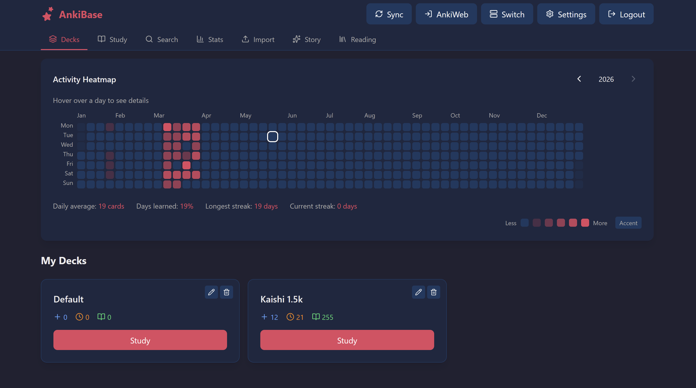
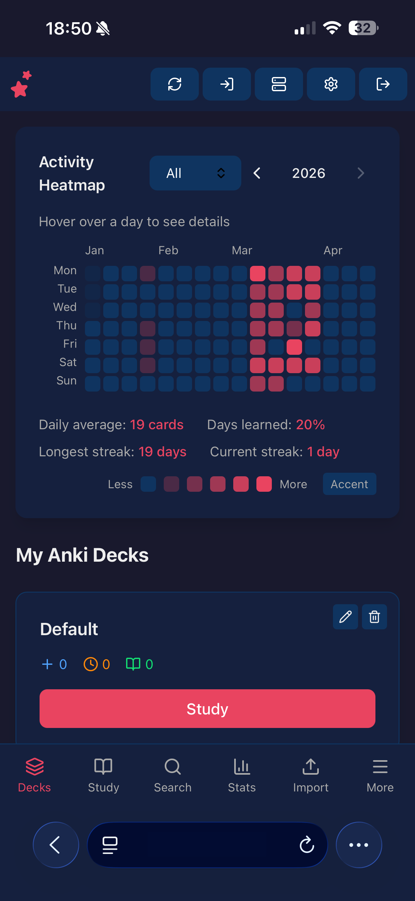

<div align="center">
  
  <h1>AnkiBase</h1>
  <p>Self-hosted web interface for Anki — study, sync, import from Quizlet, and generate AI stories</p>

  [](https://github.com/Macro002/AnkiBase/stargazers)
  [](https://github.com/Macro002/AnkiBase/network/members)
  [](LICENSE)
  [](https://github.com/Macro002/AnkiBase/commits/main)
</div>

---



---

## Features

<table>
<tr>
<td valign="top">

- **Study** — review cards with ease ratings, undo, and progress tracking
- **Decks** — browse your full deck hierarchy with new/learning/review counts
- **Quizlet Import** — paste any Quizlet URL to import decks and study them natively (images supported)
- **AI Stories** — generate vocabulary stories from your deck words (OpenAI, Anthropic, Gemini)
- **Reading** — interactive reading mode with word lookup and inline translations
- **Search** — full-text search across all notes
- **Stats** — activity heatmap filterable by Anki or Quizlet reviews
- **Import** — drag-and-drop `.apkg` file import
- **AnkiWeb Sync** — sync to/from AnkiWeb with conflict resolution
- **Multi-user** — admin panel, per-user container access control
- **Multi-account** — each account gets its own isolated Anki container
- **In-app updates** — pull the latest version without touching the server

</td>
<td align="center" valign="top" width="300">

</td>
</tr>
</table>

---

## Quick Install

Requires a Debian-based server (Debian 12/13, Ubuntu 22.04+) with root access.

```bash
curl -fsSL https://raw.githubusercontent.com/Macro002/AnkiBase/main/install.sh | sudo bash
```

The installer will:
1. Install Docker, Node.js 20, and Python if not present
2. Build the frontend
3. Find an available port (starting at 8000)
4. Generate a secret key and encryption config
5. Set up a systemd service (`ankibase`)
6. Optionally configure nginx reverse proxy + SSL via Certbot

On first visit a setup wizard walks you through creating your admin account and initializing your Anki container.

## Updating

**In-app:** An update button appears in the header when a new version is available — click it to update automatically.

**Via terminal:**
```bash
curl -fsSL https://raw.githubusercontent.com/Macro002/AnkiBase/main/install.sh | sudo bash -s -- --update
```

## Configuration

AI provider API keys (OpenAI, Anthropic, Gemini) can be added directly in the app under **Settings → API Keys** — no server access needed.

Alternatively, set them in `/opt/ankibase/backend/.env` on the server:

```env
GEMINI_API_KEY=your_key_here
OPENAI_API_KEY=your_key_here
ANTHROPIC_API_KEY=your_key_here
```

Restart after editing: `systemctl restart ankibase`

## Stack

| Layer | Tech |
|---|---|
| Backend | FastAPI + Uvicorn |
| Frontend | React 19, TypeScript, TailwindCSS v4 |
| Anki runtime | [headless-anki](https://github.com/nicholaswilde/headless-anki) (Docker) |
| Database | SQLite |
| AI providers | OpenAI, Anthropic, Google Gemini |

## Useful Commands

```bash
journalctl -u ankibase -f        # live logs
systemctl restart ankibase        # restart
systemctl status ankibase         # status
```
